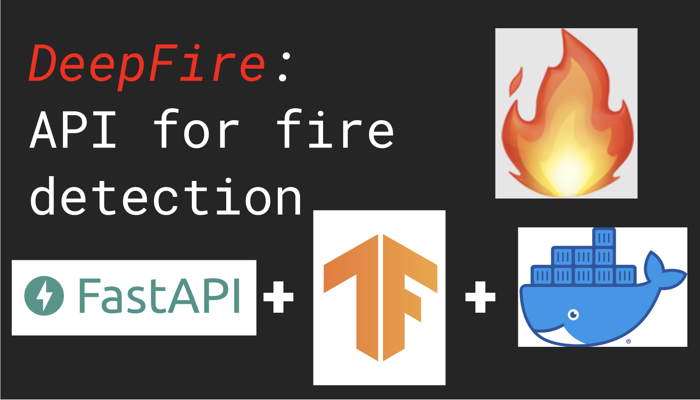

# DeepFire



An API for detecting fires in images using deep learning.

Deep learning has the power to potentially save millions of dollars (and more importantly, lives) in places like California where the annual "fire season" arrives every Fall.

We built this API to show how the technology can fight this and other crises, and inspire our students to do the same.

## Getting Started

### Use the API
To classify your own images, you can use the live API: use the link [here](https://fire-detection-api.herokuapp.com/docs) to read the documentation and send requests.

### Running Locally
You only need to use ONE of the following options:

#### Using Virtual Environments

This is *recommended* for the stage of the project. It will allow you to also run the automated tests (discussed below). Here are the commands to install the dependencies locally:

```
$ python3 -m venv env  
$ source env/bin/activate 
(env) $ python -m pip install -r requirements.txt
```
And then run the app using `uvicorn` in the Command Line:
```
(env) $ uvicorn app.main:app --reload  
```
Then head over to [http://localhost:8000/docs](http://localhost:8000/docs) or [http://localhost:8000/redoc](http://localhost:8000/redoc) in the browser.

### Run the Tests
To run the tests, you will first need to set up a Python virtual environment to run this project locally (see above). Then you can run the automated tests from the root directory, using the command line:
```
(env) $ pytest
```
If there are no failures, then you should be good to go!
You can inspect the code for the tests in `app/main_test.py` if you wish.

## The Data and the Model
The image dataset and neural network model used for the production API will be documented on the [Releases](https://github.com/UPstartDeveloper/Fire-Detection-API/releases) page of this repository.

## Making Your Own Deep Learning API

TBD

## Deploying to Heroku

TBD
## Stretch Challenges

In this project, we've worked with different tools like Tensorflow, Docker, FastAPI and Heroku. The next steps would be to two-fold:

- For the **modelling** engineers: how would you improve the neural networks performance?
- For the **MLOps** engineers: how would you improve the performance and scalability of the REST API in production?

## Credits and Resources
1. This *Towards Data Science* [blog](https://towardsdatascience.com/a-step-by-step-tutorial-to-build-and-deploy-an-image-classification-api-95fa449f0f6a) by Youness Mansar will give you a little more detail on how you can build a deployment-driven deep learning project (using the Google Cloud Platform's App Engine).
2. Another [blog](https://towardsdatascience.com/how-to-deploy-your-fastapi-app-on-heroku-for-free-8d4271a4ab9#beb1) by  Shinichi Okada in *Towards Data Science* will give more details how to deploy FastAPI applications (such as this repo!) on Heroku specifically.
3. If you're curious to know why we used `python -m pip` in the [Using Virtual Environments](#using-virtual-environments) section, please read this [explanation](https://snarky.ca/why-you-should-use-python-m-pip/) to see how it differs from just using `pip`/`pip3`.
